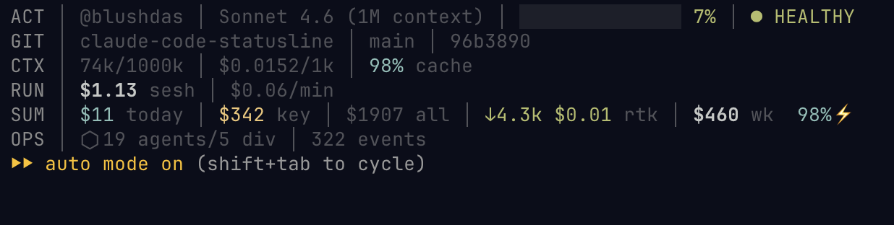

# claude-code-statusline

A real-time statusline for [Claude Code](https://docs.anthropic.com/en/docs/claude-code) that tracks context usage, costs, and model discipline.



## What It Shows

```
ACT │ @user │ Sonnet 4.6 │ ████████░░░░░░ 67% │ ● ATTENTION
GIT │ claude-code-statusline │ main │ a1b2c3d
CTX │ 67.3k/200k │ $0.0031/1k │ 87% cache
RUN │ $0.29 sesh │ $0.42/min
SUM │ $118 today │ $291 key │ $2054 all │ ↓978k $2.93 rtk │ $460 wk │ 98%⚡
```

When Opus is active without a Commander workflow, the model name flips to a red-background warning and a `OPUS-NO-CMDR` badge appears after the health indicator.

**ACT:** GitHub username · model name (Opus guard) · context bar · health status

**GIT:** repo · branch · short commit, only when inside a git repo

**CTX:** tokens used/limit · cost per 1k tokens · cache hit rate, when available

**RUN:** current session spend · live burn rate

**SUM:** today · key month-to-date · lifetime · RTK savings · 7-day CodeBurn total + cache hit %, when available

**OPS** (optional): Astra Agent SDK status: agent count · workflow state · event/error count

## Features

- **Context rot tracking** — visual progress bar with color-coded health warnings (5 tiers)
- **Real-time cost** — per-1k-token rate, session total, and burn rate ($/min)
- **Today's cost** — live daily spend pulled from claudelytics (cached 60s, background refresh)
- **Key MTD** — per-key month-to-date cost tracked locally from Claude Code sessions
- **Lifetime total** — cumulative spend across all sessions (from claudelytics)
- **Opus guard** — red warning when Opus is active without a Commander workflow executing
- **RTK integration** — today's token savings from RTK compression (optional, background refresh)
- **CodeBurn integration** — 7-day rolling cost + cache hit % from CodeBurn (optional, cached 5 min)
- **GitHub identity** — shows your `@username` from `gh` CLI
- **Cost alerts** — `⚠ $X.XXXX BURN` at $3+ (red), `⚠ BURN` badge at $5+ (red background)

## Quick Install

```bash
git clone https://github.com/blushdas/claude-code-statusline.git
cd claude-code-statusline
bash install.sh
```

The installer will:
1. Copy `statusline.sh` to `~/.claude/statusline.sh`
2. Add the `statusLine` config to `~/.claude/settings.json` (preserves existing settings)
3. Optionally prompt for environment variables and launchd daemon

## Manual Setup

### 1. Copy the script

```bash
cp statusline.sh ~/.claude/statusline.sh
chmod +x ~/.claude/statusline.sh
```

### 2. Add to settings

Add this to `~/.claude/settings.json`:

```json
{
  "statusLine": {
    "type": "command",
    "command": "bash ~/.claude/statusline.sh"
  }
}
```

### 3. Restart Claude Code

The statusline appears at the bottom of your terminal.

## Configuration

All configuration is via environment variables. Add these to your `.zshrc` / `.bashrc`:

| Variable | Required | Description |
|----------|----------|-------------|
| `ANTHROPIC_BILLING_START_DAY` | No | Day of month your billing cycle starts (default: 01) |
| `CLAUDE_STATUSLINE_DEBUG` | No | Set to `1` for diagnostic logs at `~/.claude/.statusline_debug.log` |

### Example `.zshrc`

```bash
# Claude Code Statusline
export ANTHROPIC_BILLING_START_DAY="15"
```

## Dependencies

| Tool | Required | Purpose |
|------|----------|---------|
| `jq` | **Yes** | JSON parsing |
| `gh` | Yes (soft) | GitHub username display |
| `claudelytics` | No | Today's cost + lifetime total (background, cached 60s) |
| `sqlite3` | No | RTK savings display (background, cached 5 min) |
| `codeburn` | No | 7-day rolling cost + cache hit % (background, cached 5 min) |

No `bc` required — all float math uses `awk`.

## Context Rot Thresholds

Based on Claude Opus 4.6 Context Management Spec v1.0:

| Threshold | Color | Status | Meaning |
|-----------|-------|--------|---------|
| 0–50% | 🟢 Green | `● healthy` | Normal operation |
| 50–75% | 🟡 Yellow | `● ATTENTION` | Consider compacting soon |
| 75–90% | 🟠 Orange | `● CHECKPOINT` | Start wrapping up |
| 90–95% | 🔴 Red | `● CRITICAL` | Context degraded — compact now |
| 95%+ | 🔴 Red bg | `◉◉ EMERGENCY` | Start new session immediately |

## Data Sources

Each number in Row 2 comes from a different source:

| Display | Source | Freshness |
|---------|--------|-----------|
| `$/1k` | Claude Code JSON pipe | Real-time |
| `tokens/limit` | Claude Code JSON pipe | Real-time |
| `$ session` | Claude Code JSON pipe | Real-time |
| `$/min` | Calculated from session cost + duration | Real-time |
| `$ today` | claudelytics → JSONL files | 60s cache |
| `$ key` | Local accumulator (`.cc_sessions.json`) | Per-tick |
| `$ all` | claudelytics lifetime total | 60s cache |
| `↓Xk rtk` | RTK SQLite DB | 5 min cache |
| `$X wk` | CodeBurn (`codeburn status --period week`) | 5 min cache |
| `XX%⚡` | CodeBurn 7-day cache hit % | 5 min cache |

**Why do the numbers differ?** Each uses a different methodology:
- **key** = sum of peak costs per session, tracked locally since statusline was installed (per-key MTD)
- **today** = recalculated from token counts in JSONL files by claudelytics (most accurate for the day)
- **all** = lifetime total across every transcript claudelytics has seen

## Persistent Files

All state is stored in `~/.claude/`:

| File | Purpose | TTL |
|------|---------|-----|
| `.cc_sessions.json` | Peak cost per session (billing MTD) | Monthly reset |
| `.cc_billing_month` | Current billing YYYYMM | Monthly |
| `.gh_user_cache` | GitHub username | 60 min |
| `.claudelytics_today_cache` | Today's cost from claudelytics | 60s |
| `.claudelytics_total_cache` | Lifetime total from claudelytics | 60s |
| `.rtk_today_cache` | RTK savings today | 5 min |
| `.codeburn_week_cache` | CodeBurn 7-day cost + cache % | 5 min |
| `.statusline_state.json` | Unified state snapshot (consumed by hooks) | Per-tick |

## Opus Guard

The statusline flags Opus usage so you don't get a surprise bill.

- **Opus + Commander workflow executing** → model name rendered in bold magenta (acceptable: Opus is doing planning/dispatch work)
- **Opus + no Commander workflow** → model name flipped to white-on-red `⚠ Opus X.X ` and a red `OPUS-NO-CMDR` badge appears after the health indicator

The guard checks for a workflow state file at `~/.astra/workflow/<session_id>.json` with `status: "executing"`. If that's not present, Opus usage is treated as undisciplined.

Pair with a matching `UserPromptSubmit` hook to print an inline warning on every prompt.

## Troubleshooting

**Statusline not showing?**
- Make sure `~/.claude/settings.json` has the `statusLine` config
- Restart Claude Code after making changes

**`jq: command not found`**
- Install jq: `brew install jq` (macOS) or `apt install jq` (Linux)

**CC cost shows $0.00?**
- Costs accumulate from Claude Code sessions as you use it
- The counter resets each billing cycle (`ANTHROPIC_BILLING_START_DAY`)
- Check current total: `jq '[.[]] | add // 0' ~/.claude/.cc_sessions.json`
- Reset manually: `echo '{}' > ~/.claude/.cc_sessions.json`

**Today cost shows `?`?**
- Install claudelytics: `cargo install claudelytics`
- On first run, the cache needs to populate — wait one tick after install

**RTK savings not showing?**
- Install RTK and ensure it has tracked at least one command today
- Check: `~/.local/bin/rtk gain --format json`

**GitHub username not showing?**
- Make sure you're logged in: `gh auth status`
- Cache refreshes every 60 minutes: `cat ~/.claude/.gh_user_cache`

## License

MIT — see [LICENSE](LICENSE)
